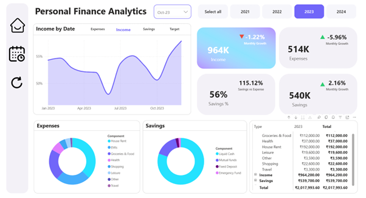
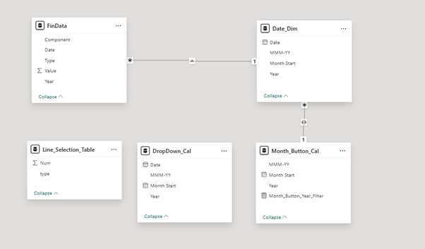

# Personal Finance Insights (Power BI)

Managing personal finances is not just about tracking numbers, but about understanding patterns, trends, and trade-offs over time.  
This project was created to analyze personal income, expenses, and savings using Power BI, with a strong focus on monthly and yearly financial behavior rather than static summaries.

The dashboard consolidates multiple years of financial data into an interactive analytical report that supports reflection, comparison, and informed financial decision-making.

---

## Table of Contents
- [Project Context](#project-context)
- [Dashboard Overview](#dashboard-overview)
- [Analytical Focus](#analytical-focus)
- [Technical Approach](#technical-approach)
- [Screenshots](#screenshots)
- [Notes](#notes)

---

## Project Context

The motivation behind this dashboard was to move beyond simple expense tracking and explore deeper analytical questions.  
Rather than viewing income, expenses, and savings as isolated values, the report models them as interconnected financial components evolving over time.

This approach allows trends, growth rates, and category-level contributions to be analyzed in a structured and meaningful way.

---

## Dashboard Overview

The report provides a consolidated view of personal financial performance across multiple years, enabling:
- Time-based comparison of income, expenses, and savings
- Month-over-month growth and decline analysis
- Category-level expense and savings insights
- Dynamic exploration using year and month filters

The emphasis is on clarity, interpretability, and analytical depth rather than decorative visual design.

---
## Live Report

The interactive version of this dashboard has been published on Power BI Service and can be accessed using the link below:

**View Live Report:**  [🔗]([https://app.powerbi.com/viewr=eyJrIjoiMjU5MDczZWItY2ZlNy00NTU5LTk5YWMtZjBmNDc2YzM1MmM1IiwidCI6ImFlY2ZkNDQ2LThlZGEtNDA1YS1hNzk0LTdkNzk0MGFmMDRkZiJ9&pageName=1ea39a98b00690e437ac](https://app.powerbi.com/view?r=eyJrIjoiMjU5MDczZWItY2ZlNy00NTU5LTk5YWMtZjBmNDc2YzM1MmM1IiwidCI6ImFlY2ZkNDQ2LThlZGEtNDA1YS1hNzk0LTdkNzk0MGFmMDRkZiJ9))

The published report allows full interaction with filters and visuals as intended in the Power BI environment.

## Analytical Focus

Key analytical themes explored in the dashboard include:
- Financial growth patterns across months and years
- Expense contribution by category
- Savings behavior relative to income and expenses
- Trend consistency and seasonal variations

The report is designed to support analytical reasoning rather than static reporting.

---

## Technical Approach

The dataset is modeled using a structured data model optimized for time-based analysis.  
DAX measures play a central role in the report, enabling:
- Month-over-month calculations
- Previous period comparisons
- Dynamic KPIs and indicators
- Context-aware measures responding to slicers

Power BI’s interaction model is leveraged to enable flexible and intuitive data exploration.

---

## Screenshots

### Dashboard Overview

### Data Model & Analytical View

Additional visuals and breakdowns are available in the `screenshots` folder.

---

> **Note**
>
> This project was initially inspired by a guided Power BI project available on YouTube.  
> The final implementation diverges from the guided version, with substantial changes to the DAX logic and the addition of multiple custom measures and tables to achieve the final analytical report.
